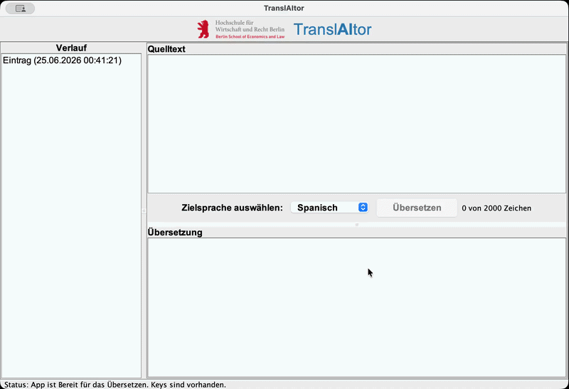

## General

Dies ist der GitHub Repo für unser LLM-Proxy-Klasse Projekt in OOP2. Das Repository ist [hier](https://github.com/snowsoftbit/Translator_P1_LLM_Proxy) abrufbar. Ziel war es ein Translator Tool zu erstellen welches...

-(Idee)Eigene Java-Klasse kapselt Zugriff auf
ein LLM (z.B. OpenAI API). Die
Anwendung nutzt die Proxy-Klasse
für KI-gestützte Features.

-(GUI Swing) Chat-Interface, Verlaufsanzeige,
Modell-Auswahl, Prompt-Templates –
alles mit Swing-Komponenten
realisiert.

-(Persistenz) Gesprächsverläufe, API-Schlüssel
(verschlüsselt) und Einstellungen
werden in Dateien oder einer
Datenbank gespeichert.

## Root Folder

```text
Translator_P1_LLM_Proxy/
├── data/
│   └── history.json
├── docs/
│   ├──uml
│   │  ├── 260623_UML_User_Translates_Text_Sequence.drawio
│   │  └── 260624_UML_Translator_Klassendiagram.drawio
│   │
│   └── media
│       └── 260625_demo.gif
│
│ 
├── src/
│   └── main/
│       ├── resources/
│       │    └── images/
│       │        └── HWR_LOGO.png
│       └── java/
│           ├── app/
│           │   └── Main.java
│           │
│           ├── model/
│           │   ├── ChatEntry.java
│           │   ├── TranslationRequest.java
│           │   └── TranslationResponse.java
│           │
│           ├── persistence/
│           │   ├── ChatHistoryDAO.java
│           │   └── FileChatHistoryDAO.java
│           │
│           ├── service/
│           │   ├── LlmClient.java
│           │   ├── LlmProxy.java
│           │   └── TranslationService.java
│           │
│           └── ui/
│               ├── HeaderPanel.java
│               ├── HistoryPanel.java
│               ├── MainFrame.java
│               ├── StatusPanel.java
│               └── TranslationPanel.java
│
├── .gitignore
├── pom.xml
├── README.md
└── TRANSLATOR_P1_LLMPROXY.env.example
```

## Team Mitglieder und Rollen

- Zuständig für Fenster und Grundlayout:[@leonjonasilg-design](https://github.com/leonjonasilg-design)

- Zuständig für Service, API und Integration: [@snowsoftbit](https://github.com/snowsoftbit)

- Zuständig für Daten und JSON-Speicherung:[@LeanderGuelland](https://github.com/Burak92)

- Zuständig für Übersetzungsbereich:[@Burak92](https://github.com/LeanderGuelland)

## Bedienung und Anleitung für die Nutzung der App

1. Schreibe ein Text in das Eingabefeld 
2. Wähle deine Zielsprache 
3. Clicke auf „Übersetzen“ 
4. Lese deine fertige Übersetzung im Ausgabefeld 
5. Der Eintrag wird automatisch im Verlauf gespeichert
6. Unter Verlauf finden Sie frühere Übersetzungen
7. Der Button „Neuer Chat“ leert die Eingabe und Ausgabe, um eine Neue Übersetzung zu tätigen

### Hint: Die Statusanzeige unten zeigt, ob API-Schlüssel vorhanden sind

